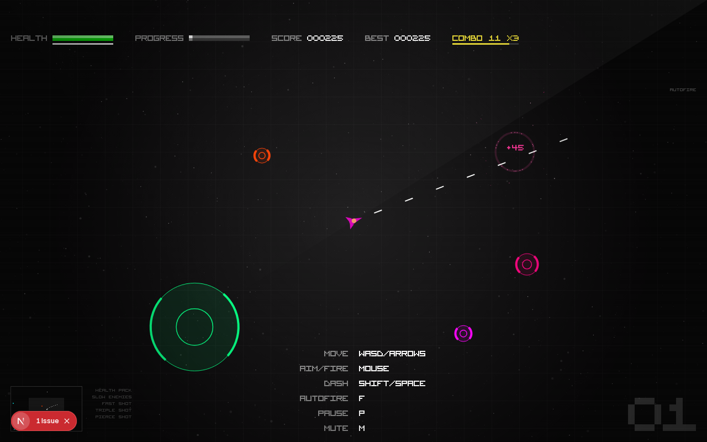

# Raid Shooter

Free arcade twin-stick raid shooter that runs instantly in the browser. Draft
upgrades mid-run, chain kill combos, dash through hazards, survive rotating
sectors, defeat the Asteroid King, and claim your rank on **Shooterboard**
with your wallet.



## Features

- **Upgrade drafts** — pick 1 of 3 stackable upgrades on every level up
- **Combo scoring** — kill chains multiply score up to x8; getting hit breaks the chain
- **Dash** — Shift/Space on desktop, double-tap the movement side on touch; brief invincibility
- **16 enemy types** plus FAST / ARMORED / REGEN elites
- **Rotating sectors** — Deep Space, Asteroid Belt, Black Hole Zone, Solar Storm, each with its own hazard
- **Boss raids** — the Asteroid King guards every fifth level; killing it grants a bonus upgrade pick
- **Pilots** — Onyix, Nova, and Tank Rex, unlocked by playing (never sold); five more teased in the HANGAR
- **Shooterboard** — global leaderboard; anyone can view, a verified wallet (SIWE) claims your rank
- Full **desktop + mobile** support: twin virtual joysticks, on-screen pause/mute, landscape prompt

## Controls

| Action | Desktop | Mobile |
|---|---|---|
| Move | WASD / arrows | Left thumb joystick |
| Aim + fire | Mouse (hold) | Right thumb joystick |
| Dash | Shift / Space | Double-tap left side |
| Autofire | F | — |
| Pause | P | PAUSE button |
| Mute | M | MUTE button |

## Running locally

```bash
npm install
cp .env.example .env.local   # then fill in the values
npm run dev
```

Open http://localhost:3000.

## Environment variables

| Variable | Required for | Notes |
|---|---|---|
| `SESSION_SECRET` | Wallet sign-in (SIWE) | Random string, 32+ characters |
| `NEXT_PUBLIC_REOWN_PROJECT_ID` | Wallet connection | Free at https://cloud.reown.com |
| `KV_REST_API_URL` / `KV_REST_API_TOKEN` | Shooterboard persistence | Auto-added by attaching Upstash Redis in Vercel (Storage tab). Without it the board uses ephemeral in-memory storage |

## Deployment

Deploys on Vercel as a standard Next.js app (`vercel.json` pins the
framework). Set the environment variables above in the Vercel project,
and attach an Upstash Redis store for a persistent leaderboard.

## Credits

Created by **David Grateful**, with support from Dev Dervel and Isra, and the
many more who helped cook this.

Game engine based on [Radius Raid](https://github.com/jackrugile/radius-raid-js13k)
by Jack Rugile (JS13K 2013).
